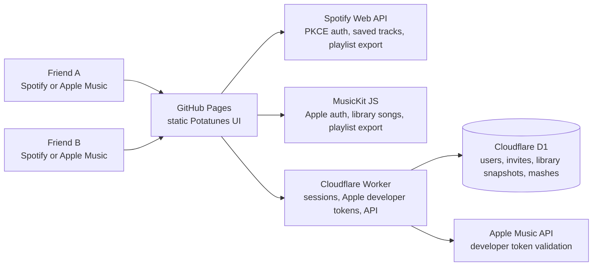

# Potatunes

Potatunes is a small web app for two friends on different music platforms to find the songs they both like. One person can use Spotify, the other can use Apple Music, and Potatunes creates a shared mash that can be exported back to Spotify, Apple Music, or CSV.

The app is hosted as a static GitHub Pages site, with a Cloudflare Worker and D1 database for the parts that cannot safely live in the browser: Apple Music token signing, user sessions, short invite links, saved library snapshots, and stored mashes.

## Architecture



## How It Works

1. A user signs in with Spotify or Apple Music.
2. Potatunes reads their saved/library songs and stores a D1 library snapshot.
3. That snapshot is reused for one week, so logging in again does not keep re-pulling the whole library.
4. The user copies a short invite link and sends it to a friend.
5. The friend signs in, Potatunes compares both stored libraries, and the mash is saved in D1.
6. The logged-in home page shows `Mashed Potatunes`: one card per friend mash, with the overlap count.
7. Opening a mash at `#/mash/<mash-id>` shows the paginated song list and export buttons.

## Matching

Potatunes currently uses deterministic matching instead of an LLM. It prefers exact ISRC matches when available, then normalized title and artist matching, plus fuzzy title/artist/duration scoring. It normalizes common differences like radio edits, remasters, punctuation, featured artists, and duplicate releases, while penalizing likely-different versions like live, acoustic, instrumental, karaoke, and remix.

This keeps the public GitHub Pages app free of LLM API secrets.

## Secrets

No private secrets belong in GitHub Pages or `config.js`.

- Spotify uses Authorization Code with PKCE, so the browser only needs `SPOTIFY_CLIENT_ID`.
- Apple Music developer tokens are signed by the Cloudflare Worker.
- The Apple private key and Potatunes session secret live only in Cloudflare Worker secrets.
- Invite links contain short slugs, not provider tokens.

## Deploy Notes

Frontend config is generated into `config.js` locally, and into `dist/config.js` in GitHub Actions.

Required frontend values:

```text
SPOTIFY_CLIENT_ID
SPOTIFY_REDIRECT_URI
APPLE_TOKEN_ENDPOINT
POTATUNES_API_BASE
APPLE_STOREFRONT_ID
```

Required Worker secrets:

```text
APPLE_TEAM_ID
APPLE_KEY_ID
APPLE_MEDIA_SERVICES_PRIVATE_KEY
POTATUNES_SESSION_SECRET
```

Useful commands:

```bash
npm run build:config
npm run db:migrate:local
npm run db:migrate:remote
npm run worker:deploy
```

GitHub Pages deploys from `.github/workflows/deploy-pages.yml`. The Cloudflare Worker deploys from `worker/src/index.js` and uses the D1 binding in `worker/wrangler.toml`.
